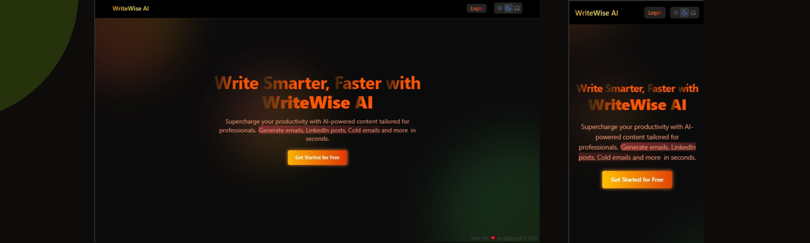

<div align="center">
  <br />
    <a href="https://writewise-ai.vercel.app/" target="_blank">
      
    </a>
  <br />

<div>
  
  
  
  
  


</div>


<h1 align="center">WriteWise AI</h3>
</div>

## 🚀 Live

🔗 [View Project](https://writewise-ai.vercel.app/)

## <a name="introduction">🤖 Introduction</a>

WriteWise AI is an AI-powered writing assistant designed to help professionals craft clear, compelling, and grammatically correct content with ease. Whether you're writing emails, reports, social media posts, or creative pieces, WriteWise AI enhances your productivity by generating high-quality text tailored to your needs.

## ⚙️ Tech Stack

- ✔️ Next.js 15
- ✔️ TailwindCSS
- ✔️ Firebase
- ✔️ TypeScript
- ✔️ OpenAI API
- ✔️ Framer Motion

## ✨ Features

- **AI-Powered Text Generation (LLaMA via OpenRouter API)****: Generate high-quality, professional content using Meta’s LLaMA model accessed through the OpenRouter API — combining open-source language modeling with seamless API integration and flexibility.
- **Real-Time Streaming Output**: Watch your content appear word by word, enhancing interactivity.
- **One-Click Copy**: Quickly copy the generated content for use anywhere.
- **Auto-Save & Manage History**: Every generation is automatically saved to your personal history. Easily delete specific entries or clear your entire history with a single click.
- **Authentication**: Secure login and sign-up with email, third-party providers, or continue instantly as a guest — no sign-up required.
- **Responsive Design**: Seamless adaptability across all devices, ensuring optimal viewing experience for every user.
- **Dark Mode with System Preference**: Automatically adapts to your device’s theme (light or dark) for a seamless experience.
- **Form Validation**: Robust client-side validation ensures clean input and a smooth user experience.

and many more, including code architecture and reusability

Follow these steps to set up the project locally on your machine.

**Prerequisites**

Make sure you have the following installed on your machine:

- [Git](https://git-scm.com/)
- [Node.js](https://nodejs.org/en)
- [npm](https://www.npmjs.com/) (Node Package Manager)

**Cloning the Repository**

```bash
git clone https://github.com/Daniyalk0/writewiseAI
cd writewiseAI
```

**Installation**

Install the project dependencies using npm:

```bash
npm install
```

**Running the project locally**

```bash
npm run dev
```
